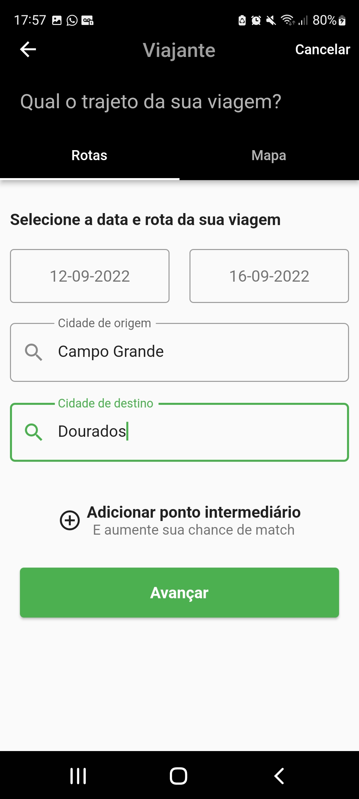

# Muvver

Muvver App

## Getting Started

Muvver app para criar uma viagem dentro de uma aplicação
que visa o uso de mobilidade compartilhada.

Essa aplicação possui diversas
funcionalidades, porém neste teste o foco é entregar somente uma delas, que é o cadastro
de uma viagem feita por um usuário.

(https://youtu.be/O2HJA1M-OmU "Video App")   

| | | |
|:-------------------------:|:-------------------------:|:-------------------------:|
|  Home |   Details| Map|
| Product Size |   Product Weight| Price|
 Finish

